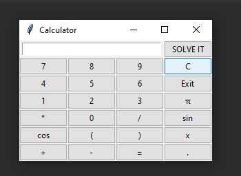

# Calculator
 Equation Calculator

#Описание проекта
Данное приложение представляет калькулятор уравнений с небольшим функционалом.
Калькулятор обладает простым и понятным любому пользователю интерфейсом.
На данный момент решает уравнения, где надо найти переменную Х, а также простые выражения, по типу a*b+c*2.

##Интерфейс приложения
\
В начале окна находится поле для ввода уравнений

####Действия кнопок
'SOLVE IT' - кнопка решения введённого уравнения\
'C' - очищает полностью строку ввода\
'Exit' - выход из приложения\
'*' - знак умножения\
'/' - знак деления\
'+' - знак сложения\
'-' - знак вычитания\
'cos' - косинус\
'sin' - синус\
'π' - число PI\
'.' - точка для разделения десятичных дробей\
'(' и ')' - скобки для установки приоритетов операций
###Операции в калькуляторе
Сложение: a + b\
Вычитание: a - b\
Умножение: a * b\
Деление: a / b\
Возведение в степень: a ** b\
Извлечение корня: a ** (1/b)

#Запуск приложения
