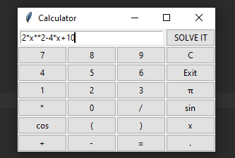
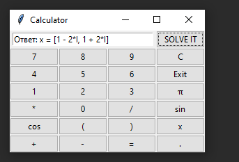

# Calculator
 Equation Calculator

# Описание проекта
Данное приложение представляет калькулятор уравнений с небольшим функционалом.
Калькулятор обладает простым и понятным любому пользователю интерфейсом.
На данный момент решает уравнения, где надо найти переменную Х, а также простые выражения, по типу a*b+c*2.

## Интерфейс приложения
\
В начале окна находится поле для ввода уравнений

#### Действия кнопок
'SOLVE IT' - кнопка решения введённого уравнения\
'C' - очищает полностью строку ввода\
'Exit' - выход из приложения\
'*' - знак умножения\
'/' - знак деления\
'+' - знак сложения\
'-' - знак вычитания\
'cos' - косинус\
'sin' - синус\
'π' - число PI\
'.' - точка для разделения десятичных дробей\
'(' и ')' - скобки для установки приоритетов операций
'x' - Знак переменной х для уравнений

### Операции в калькуляторе
Сложение: a + b\
Вычитание: a - b\
Умножение: a * b\
Деление: a / b\
Возведение в степень: a ** b\
Извлечение корня: a ** (1/b)

### Возможные ошибки при написании выражений:
На текущем этапе разработки калькулятор позволяет пользователю вводить числа по типу "2.0.02.2", однако результат работы с аналогичными числами получен не будет.

Также пока-что калькулятор не умеет работать с отсутствием знака умножения, а именно выражения по типу ab+c, 2x, 2cosx он не понимает и выдаёт ошибку.\

Калькулятор уравнений умеет искать значение только переменной x.

# Запуск приложения
1. Для запуска приложения необходимо скачать и распаковать данный проект.
2. Запустить командную строку.
3. Проверить установку python3 на данном устройстве. В случае отсутствия скачать.
4. Установить требуемые библиотеки:\
___pip3 install sympy___\
___pip3 install tkinter___
5. Перейти в расположение файла main.py с помощью команды cd
___cd /Путь___
6. Произвести запуск приложения\
___py main.py___

# Пример работы с приложением
Пример ввода и получения ответа на уравнение 2x^2-4x+10=0\
___Вводим уравнение___\
\
___Нажимаем кнопку SOLVE IT___\
\
В ответе получены два числа x1 и x2.

# Устройство программы
Программа состоит из двух основных классов - Interface и Calculator.
## class Calculator
Объекты данного класса содержат четыре метода:
1. solveEq(eq_left, eq_right) - метод поиска решения уравнения не равного нулю, возвращает список найденных решений.
2. solveEqi(eq) - метод поиска решения уравнения, для которого пользователь не ввёл правую часть. Возвращает список найденных решений.
3. solveExp(exp) - метод решения простого выражения(expression). Возвращает список найденных решений.
4. separateEq(eq) - метод разделения строки, содержащей выражение, на левую и правую части. Возвращает список, содержащий две строки, разделённых знаком '='.

## class Interface
Данный класс обладает простым конструктором, который создаёт окно программы с именем "Calculator", добавляет в него поле для ввода текста и кнопки, которые прописаны в отдельном списке.
1. checkTypeOfEq(eq) - метод проверки типа введённого пользователем выражения. В случае обычного выражения возвращает 'exp', 'eq0' - если пользователь не ввёл правую часть, 'eq' - простое уравнение.
2. setNewSymbolToEq(self, i) - метод добавления нового символа в выражение(по клику пользователя по кнопке). Проверяет нажатую кнопку и выполняет соответствующее действие.
3. solveEq(self) - метод получения результата решения уравнения после нажатия кнопки 'SOLVE IT'. Запускает нужный метод объекта класса Calculator в зависимости от типа введённого уравнения.
4. setButtons(self, root) - метод заполнения окна кнопками.

Действия(краткий алгоритм) после запуска программы:
1. Создание и заполнение окна программы кнопками.
2. Ожидание ввода пользователя.
3. Каждое нажатие кнопки пользователем обрабатывается, формируется строка, содержащая выражение или уравнение.
4. После нажатия 'SOLVE IT' полученная строка с выражением анализируется, после чего создаётся объект класса Calculate и вычисляется результат или значение переменной x.

